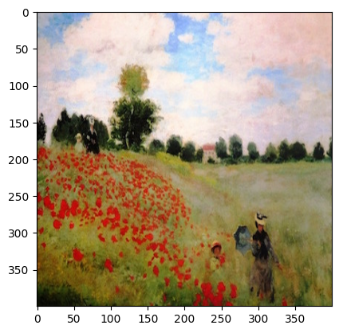

# Deep Learning & Art: Neural Style Transfer


```python
import os
import sys
import scipy.io
import scipy.misc
import matplotlib.pyplot as plt
from matplotlib.pyplot import imshow
from PIL import Image
import numpy as np
import tensorflow as tf
from tensorflow.python.framework.ops import EagerTensor
import pprint
%matplotlib inline
```


```python
tf.random.set_seed(272) # DO NOT CHANGE THIS VALUE
pp = pprint.PrettyPrinter(indent=4)
img_size = 400
vgg = tf.keras.applications.VGG19(include_top=False,
                                  input_shape=(img_size, img_size, 3),
                                  weights='pretrained-model/vgg19_weights_tf_dim_ordering_tf_kernels_notop.h5')

vgg.trainable = False
pp.pprint(vgg)
```

    <keras.engine.functional.Functional object at 0x0000015C44F122E0>
    


```python
content_image = Image.open("images/louvre.jpg")
print("The content image (C) shows the Louvre museum's pyramid surrounded by old Paris buildings, against a sunny sky with a few clouds.")
content_image
```

    The content image (C) shows the Louvre museum's pyramid surrounded by old Paris buildings, against a sunny sky with a few clouds.
    


    

    


```python
def compute_content_cost(content_output, generated_output):
    """
    Computes the content cost
    
    Arguments:
    a_C -- tensor of dimension (1, n_H, n_W, n_C), hidden layer activations representing content of the image C 
    a_G -- tensor of dimension (1, n_H, n_W, n_C), hidden layer activations representing content of the image G
    
    Returns: 
    J_content -- scalar that you compute using equation 1 above.
    """
    a_C = content_output[-1]
    a_G = generated_output[-1]
    
    
    # Retrieve dimensions from a_G 
    m, n_H, n_W, n_C = a_G.get_shape().as_list()
    
    # Reshape a_C and a_G 
    a_C_unrolled = tf.reshape(a_C, shape=[m, n_H * n_W, n_C]) # Or tf.reshape(a_C, shape=[m, -1 , n_C])
    a_G_unrolled = tf.reshape(a_G, shape=[m, n_H * n_W, n_C]) # Or tf.reshape(a_G, shape=[m, -1 , n_C])
    
    # compute the cost with tensorflow 
    J_content =  tf.reduce_sum(tf.square(a_C_unrolled - a_G_unrolled))/(4.0 * n_H * n_W * n_C)
    
    
    return J_content
```


```python
example = Image.open("images/monet_800600.jpg")
example
```


    

    


```python
def gram_matrix(A):
    """
    Argument:
    A -- matrix of shape (n_C, n_H*n_W)
    
    Returns:
    GA -- Gram matrix of A, of shape (n_C, n_C)
    """  
    GA = tf.matmul(A, tf.transpose(A))

    return GA
```


```python
def compute_layer_style_cost(a_S, a_G):
    """
    Arguments:
    a_S -- tensor of dimension (1, n_H, n_W, n_C), hidden layer activations representing style of the image S 
    a_G -- tensor of dimension (1, n_H, n_W, n_C), hidden layer activations representing style of the image G
    
    Returns: 
    J_style_layer -- tensor representing a scalar value, style cost defined above by equation (2)
    """
    
    # Retrieve dimensions from a_G (≈1 line)
    m, n_H, n_W, n_C = a_G.get_shape().as_list()
    
    # Reshape the images to have them of shape (n_C, n_H*n_W) (≈2 lines)
    a_S = tf.transpose(tf.reshape(a_S, shape=[-1, n_C]))
    # OR a_S = tf.transpose(tf.reshape(a_S, shape=[ n_H * n_W, n_C]))
    a_G = tf.transpose(tf.reshape(a_G, shape=[-1, n_C]))
    # Computing gram_matrices for both images S and G (≈2 lines)
    GS = gram_matrix(a_S)
    GG = gram_matrix(a_G)
    
    # Computing the loss (≈1 line)
    J_style_layer = tf.reduce_sum(tf.square(GS - GG))/(4.0 *(( n_H * n_W * n_C)**2))
    
    return J_style_layer
```


```python
vgg.summary()
```

    Model: "vgg19"
    _________________________________________________________________
     Layer (type)                Output Shape              Param #   
    =================================================================
     input_1 (InputLayer)        [(None, 400, 400, 3)]     0         
                                                                     
     block1_conv1 (Conv2D)       (None, 400, 400, 64)      1792      
                                                                     
     block1_conv2 (Conv2D)       (None, 400, 400, 64)      36928     
                                                                     
     block1_pool (MaxPooling2D)  (None, 200, 200, 64)      0         
                                                                     
     block2_conv1 (Conv2D)       (None, 200, 200, 128)     73856     
                                                                     
     block2_conv2 (Conv2D)       (None, 200, 200, 128)     147584    
                                                                     
     block2_pool (MaxPooling2D)  (None, 100, 100, 128)     0         
                                                                     
     block3_conv1 (Conv2D)       (None, 100, 100, 256)     295168    
                                                                     
     block3_conv2 (Conv2D)       (None, 100, 100, 256)     590080    
                                                                     
     block3_conv3 (Conv2D)       (None, 100, 100, 256)     590080    
                                                                     
     block3_conv4 (Conv2D)       (None, 100, 100, 256)     590080    
                                                                     
     block3_pool (MaxPooling2D)  (None, 50, 50, 256)       0         
                                                                     
     block4_conv1 (Conv2D)       (None, 50, 50, 512)       1180160   
                                                                     
     block4_conv2 (Conv2D)       (None, 50, 50, 512)       2359808   
                                                                     
     block4_conv3 (Conv2D)       (None, 50, 50, 512)       2359808   
                                                                     
     block4_conv4 (Conv2D)       (None, 50, 50, 512)       2359808   
                                                                     
     block4_pool (MaxPooling2D)  (None, 25, 25, 512)       0         
                                                                     
     block5_conv1 (Conv2D)       (None, 25, 25, 512)       2359808   
                                                                     
     block5_conv2 (Conv2D)       (None, 25, 25, 512)       2359808   
                                                                     
     block5_conv3 (Conv2D)       (None, 25, 25, 512)       2359808   
                                                                     
     block5_conv4 (Conv2D)       (None, 25, 25, 512)       2359808   
                                                                     
     block5_pool (MaxPooling2D)  (None, 12, 12, 512)       0         
                                                                     
    =================================================================
    Total params: 20,024,384
    Trainable params: 0
    Non-trainable params: 20,024,384
    _________________________________________________________________
    


```python
for layer in vgg.layers:
    print(layer.name)
```

    input_1
    block1_conv1
    block1_conv2
    block1_pool
    block2_conv1
    block2_conv2
    block2_pool
    block3_conv1
    block3_conv2
    block3_conv3
    block3_conv4
    block3_pool
    block4_conv1
    block4_conv2
    block4_conv3
    block4_conv4
    block4_pool
    block5_conv1
    block5_conv2
    block5_conv3
    block5_conv4
    block5_pool
    


```python
vgg.get_layer('block5_conv4').output
```


    <KerasTensor: shape=(None, 25, 25, 512) dtype=float32 (created by layer 'block5_conv4')>


```python
STYLE_LAYERS = [
    ('block1_conv1', 0.2),
    ('block2_conv1', 0.2),
    ('block3_conv1', 0.2),
    ('block4_conv1', 0.2),
    ('block5_conv1', 0.2)]
```


```python
def compute_style_cost(style_image_output, generated_image_output, STYLE_LAYERS=STYLE_LAYERS):
    """
    Computes the overall style cost from several chosen layers
    
    Arguments:
    style_image_output -- our tensorflow model
    generated_image_output --
    STYLE_LAYERS -- A python list containing:
                        - the names of the layers we would like to extract style from
                        - a coefficient for each of them
    
    Returns: 
    J_style -- tensor representing a scalar value, style cost defined above by equation (2)
    """
    
    # initialize the overall style cost
    J_style = 0

    # Set a_S to be the hidden layer activation from the layer we have selected.
    # The last element of the array contains the content layer image, which must not be used.
    a_S = style_image_output[:-1]

    # Set a_G to be the output of the choosen hidden layers.
    # The last element of the list contains the content layer image which must not be used.
    a_G = generated_image_output[:-1]
    for i, weight in zip(range(len(a_S)), STYLE_LAYERS):  
        # Compute style_cost for the current layer
        J_style_layer = compute_layer_style_cost(a_S[i], a_G[i])

        # Add weight * J_style_layer of this layer to overall style cost
        J_style += weight[1] * J_style_layer

    return J_style
```


```python
@tf.function()
def total_cost(J_content, J_style, alpha = 10, beta = 40):
    """
    Computes the total cost function
    
    Arguments:
    J_content -- content cost coded above
    J_style -- style cost coded above
    alpha -- hyperparameter weighting the importance of the content cost
    beta -- hyperparameter weighting the importance of the style cost
    
    Returns:
    J -- total cost as defined by the formula above.
    """
    
    J = alpha * J_content + beta * J_style
    

    return J
```


```python
content_image = np.array(Image.open("images/louvre_small.jpg").resize((img_size, img_size)))
content_image = tf.constant(np.reshape(content_image, ((1,) + content_image.shape)))

print(content_image.shape)
imshow(content_image[0])
plt.show()
```

    (1, 400, 400, 3)
    


    

    


```python
style_image =  np.array(Image.open("images/monet.jpg").resize((img_size, img_size)))
style_image = tf.constant(np.reshape(style_image, ((1,) + style_image.shape)))

print(style_image.shape)
imshow(style_image[0])
plt.show()
```

    (1, 400, 400, 3)
    


    

    


```python
generated_image = tf.Variable(tf.image.convert_image_dtype(content_image, tf.float32))
noise = tf.random.uniform(tf.shape(generated_image), -0.25, 0.25)
generated_image = tf.add(generated_image, noise)
generated_image = tf.clip_by_value(generated_image, clip_value_min=0.0, clip_value_max=1.0)

print(generated_image.shape)
imshow(generated_image.numpy()[0])
plt.show()
```

    (1, 400, 400, 3)
    


    

    


## Load Pre-trained VGG19 Model
Define a function which loads the VGG19 model and returns a list of the outputs for the middle layers.


```python
def get_layer_outputs(vgg, layer_names):
    """ Creates a vgg model that returns a list of intermediate output values."""
    outputs = [vgg.get_layer(layer[0]).output for layer in layer_names]

    model = tf.keras.Model([vgg.input], outputs)
    return model
```


```python
content_layer = [('block5_conv4', 1)]

vgg_model_outputs = get_layer_outputs(vgg, STYLE_LAYERS + content_layer)
```


```python
content_target = vgg_model_outputs(content_image)  # Content encoder
style_targets = vgg_model_outputs(style_image)     # Style enconder
```

### Compute Total Cost


```python
# Assign the content image to be the input of the VGG model.  
# Set a_C to be the hidden layer activation from the layer we have selected
preprocessed_content =  tf.Variable(tf.image.convert_image_dtype(content_image, tf.float32))
a_C = vgg_model_outputs(preprocessed_content)
```


```python
# Assign the input of the model to be the "style" image 
preprocessed_style =  tf.Variable(tf.image.convert_image_dtype(style_image, tf.float32))
a_S = vgg_model_outputs(preprocessed_style)
```

Below are the utils that you will need to display the images generated by the style transfer model.


```python
def clip_0_1(image):
    """
    Truncate all the pixels in the tensor to be between 0 and 1
    
    Arguments:
    image -- Tensor
    J_style -- style cost coded above

    Returns:
    Tensor
    """
    return tf.clip_by_value(image, clip_value_min=0.0, clip_value_max=1.0)

def tensor_to_image(tensor):
    """
    Converts the given tensor into a PIL image
    
    Arguments:
    tensor -- Tensor
    
    Returns:
    Image: A PIL image
    """
    tensor = tensor * 255
    tensor = np.array(tensor, dtype=np.uint8)
    if np.ndim(tensor) > 3:
        assert tensor.shape[0] == 1
        tensor = tensor[0]
    return Image.fromarray(tensor)
```

### Training_step 


```python
optimizer = tf.keras.optimizers.Adam(learning_rate=0.01)

@tf.function()
def train_step(generated_image, alpha = 10, beta = 40):
    with tf.GradientTape() as tape:
        # In this function you must use the precomputed encoded images a_S and a_C
        # Compute a_G as the vgg_model_outputs for the current generated image
    
        a_G = vgg_model_outputs(generated_image)
        
        # Compute the style cost

        J_style = compute_style_cost(a_S, a_G)
        # Compute the content cost
        J_content = compute_content_cost(a_C, a_G)
        # Compute the total cost
        J = total_cost(J_content, J_style,alpha = alpha, beta = beta)
        
    grad = tape.gradient(J, generated_image)

    optimizer.apply_gradients([(grad, generated_image)])
    generated_image.assign(clip_0_1(generated_image))
    return J
```


```python
generated_image = tf.Variable(generated_image)


J1 = train_step(generated_image)
```


```python
print(J1)
```

    tf.Tensor(25525.793, shape=(), dtype=float32)
    

### Train the Mode


```python
print("Num GPUs Available: ", len(tf.config.list_physical_devices('GPU')))
```

    Num GPUs Available:  1
    


```python
# Show the generated image at some epochs
# Uncoment to reset the style transfer process. You will need to compile the train_step function agai

epochs = 2501
for i in range(epochs):
    train_step(generated_image)
    if i % 250 == 0:
        print(f"Epoch {i} ")
    if i % 250 == 0:
        image = tensor_to_image(generated_image)
        imshow(image)
        image.save(f"output/image_{i}.jpg")
        plt.show() 
```

    Epoch 0 
    


    

    


    Epoch 250 
    


    

    


    Epoch 500 
    


    

    


    Epoch 750 
    


    

    


    Epoch 1000 
    


    

    


    Epoch 1250 
    


    

    


    Epoch 1500 
    


    

    


    Epoch 1750 
    


    

    


    Epoch 2000 
    


    

    


    Epoch 2250 
    


    

    


    Epoch 2500 
    


    

    


```python
# Show the 3 images in a row
fig = plt.figure(figsize=(16, 4))
ax = fig.add_subplot(1, 3, 1)
imshow(content_image[0])
ax.title.set_text('Content image')
ax = fig.add_subplot(1, 3, 2)
imshow(style_image[0])
ax.title.set_text('Style image')
ax = fig.add_subplot(1, 3, 3)
imshow(generated_image[0])
ax.title.set_text('Generated image')
plt.show()
```


    

    

