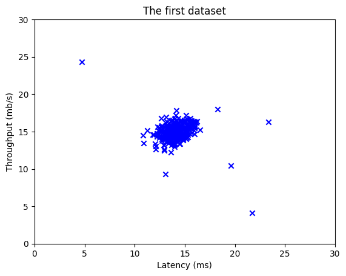
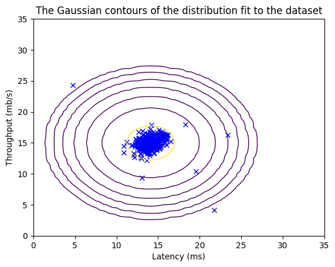
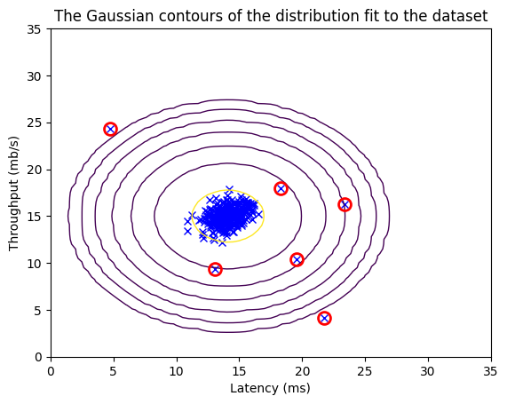

# Anomaly Detection


```python
import numpy as np
import matplotlib.pyplot as plt
from utils import *

%matplotlib inline
```


```python
# Load the dataset
X_train, X_val, y_val = load_data()
```


```python
X_train[2]
```


    array([14.19591481, 15.85318113])


```python
# Display the first five elements of X_train
print("The first 5 elements of X_train are:\n", X_train[:5])  
```

    The first 5 elements of X_train are:
     [[13.04681517 14.74115241]
     [13.40852019 13.7632696 ]
     [14.19591481 15.85318113]
     [14.91470077 16.17425987]
     [13.57669961 14.04284944]]
    


```python
# Display the first five elements of X_val
print("The first 5 elements of X_val are\n", X_val[:5])  
```

    The first 5 elements of X_val are
     [[15.79025979 14.9210243 ]
     [13.63961877 15.32995521]
     [14.86589943 16.47386514]
     [13.58467605 13.98930611]
     [13.46404167 15.63533011]]
    


```python
# Display the first five elements of y_val
print("The first 5 elements of y_val are\n", y_val[:5])  
```

    The first 5 elements of y_val are
     [0 0 0 0 0]
    


```python
print ('The shape of X_train is:', X_train.shape)
print ('The shape of X_val is:', X_val.shape)
print ('The shape of y_val is: ', y_val.shape)
```

    The shape of X_train is: (307, 2)
    The shape of X_val is: (307, 2)
    The shape of y_val is:  (307,)
    


```python
# Create a scatter plot of the data. To change the markers to blue "x",
# we used the 'marker' and 'c' parameters
plt.scatter(X_train[:, 0], X_train[:, 1], marker='x', c='b') 

# Set the title
plt.title("The first dataset")
# Set the y-axis label
plt.ylabel('Throughput (mb/s)')
# Set the x-axis label
plt.xlabel('Latency (ms)')
# Set axis range
plt.axis([0, 30, 0, 30])
plt.show()
```


    

    


```python
def estimate_gaussian(X): 
    """
    Calculates mean and variance of all features 
    in the dataset
    
    Args:
        X (ndarray): (m, n) Data matrix
    
    Returns:
        mu (ndarray): (n,) Mean of all features
        var (ndarray): (n,) Variance of all features
    """

    m, n = X.shape

    mu = 1 / m * np.sum(X, axis = 0)
    var = 1 / m * np.sum((X - mu) ** 2, axis = 0)
 
        
    return mu, var
```


```python
# Estimate mean and variance of each feature
mu, var = estimate_gaussian(X_train)              

print("Mean of each feature:", mu)
print("Variance of each feature:", var)
```

    Mean of each feature: [14.11222578 14.99771051]
    Variance of each feature: [1.83263141 1.70974533]
    


```python
# Returns the density of the multivariate normal
# at each data point (row) of X_train
p = multivariate_gaussian(X_train, mu, var)

#Plotting code 
visualize_fit(X_train, mu, var)
```


    

    


```python
def select_threshold(y_val, p_val): 
    """
    Finds the best threshold to use for selecting outliers 
    based on the results from a validation set (p_val) 
    and the ground truth (y_val)
    
    Args:
        y_val (ndarray): Ground truth on validation set
        p_val (ndarray): Results on validation set
        
    Returns:
        epsilon (float): Threshold chosen 
        F1 (float):      F1 score by choosing epsilon as threshold
    """ 

    best_epsilon = 0
    best_F1 = 0
    F1 = 0
    
    step_size = (max(p_val) - min(p_val)) / 1000
    
    for epsilon in np.arange(min(p_val), max(p_val), step_size):
    
        predictions = (p_val < epsilon) # Predictions for each example using epsilon as threshold

        tp = np.sum((predictions == 1) & (y_val == 1)) # Number of true positives
        fp = np.sum((predictions == 1) & (y_val == 0)) # Number of false positives
        fn = np.sum((predictions == 0) & (y_val == 1)) # Number of false negatives

        prec = tp / (tp + fp) # Precision
        rec = tp / (tp + fn) # Recall

        F1 = 2 * prec * rec / (prec + rec)
        
        if F1 > best_F1:
            best_F1 = F1
            best_epsilon = epsilon
        
    return best_epsilon, best_F1
```


```python
p_val = multivariate_gaussian(X_val, mu, var)
epsilon, F1 = select_threshold(y_val, p_val)

print('Best epsilon found using cross-validation: %e' % epsilon)
print('Best F1 on Cross Validation Set: %f' % F1)
```

    Best epsilon found using cross-validation: 8.990853e-05
    Best F1 on Cross Validation Set: 0.875000
    

    C:\Users\HP\AppData\Local\Temp\ipykernel_13004\562433057.py:30: RuntimeWarning: invalid value encountered in long_scalars
      prec = tp / (tp + fp) # Precision
    


```python
# Find the outliers in the training set 
outliers = p < epsilon

# Visualize the fit
visualize_fit(X_train, mu, var)

# Draw a red circle around those outliers
plt.plot(X_train[outliers, 0], X_train[outliers, 1], 'ro',
         markersize= 10,markerfacecolor='none', markeredgewidth=2)
```


    [<matplotlib.lines.Line2D at 0x2fa2342a580>]


    

    


### High dimensional dataset

- The `load_data()` function shown below loads the data into variables `X_train_high`, `X_val_high` and `y_val_high`
    -  `_high` is meant to distinguish these variables from the ones used in the previous part
    - We will use `X_train_high` to fit Gaussian distribution 
    - We will use `X_val_high` and `y_val_high` as a cross validation set to select a threshold and determine anomalous vs normal examples


```python
# load the dataset
X_train_high, X_val_high, y_val_high = load_data_multi()
```


```python
print ('The shape of X_train_high is:', X_train_high.shape)
print ('The shape of X_val_high is:', X_val_high.shape)
print ('The shape of y_val_high is: ', y_val_high.shape)
```

    The shape of X_train_high is: (1000, 11)
    The shape of X_val_high is: (100, 11)
    The shape of y_val_high is:  (100,)
    

#### Anomaly detection 

* Estimate the Gaussian parameters ($\mu_i$ and $\sigma_i^2$)
* Evaluate the probabilities for both the training data `X_train_high` from which you estimated the Gaussian parameters, as well as for the the cross-validation set `X_val_high`. 
* Finally, it will use `select_threshold` to find the best threshold $\varepsilon$. 


```python
# Estimate the Gaussian parameters
mu_high, var_high = estimate_gaussian(X_train_high)

# Evaluate the probabilites for the training set
p_high = multivariate_gaussian(X_train_high, mu_high, var_high)

# Evaluate the probabilites for the cross validation set
p_val_high = multivariate_gaussian(X_val_high, mu_high, var_high)

# Find the best threshold
epsilon_high, F1_high = select_threshold(y_val_high, p_val_high)

print('Best epsilon found using cross-validation: %e'% epsilon_high)
print('Best F1 on Cross Validation Set:  %f'% F1_high)
print('# Anomalies found: %d'% sum(p_high < epsilon_high))
```

    Best epsilon found using cross-validation: 1.377229e-18
    Best F1 on Cross Validation Set:  0.615385
    # Anomalies found: 117
    

    C:\Users\HP\AppData\Local\Temp\ipykernel_13004\562433057.py:30: RuntimeWarning: invalid value encountered in long_scalars
      prec = tp / (tp + fp) # Precision
    
