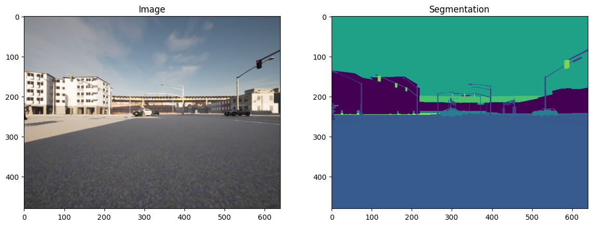
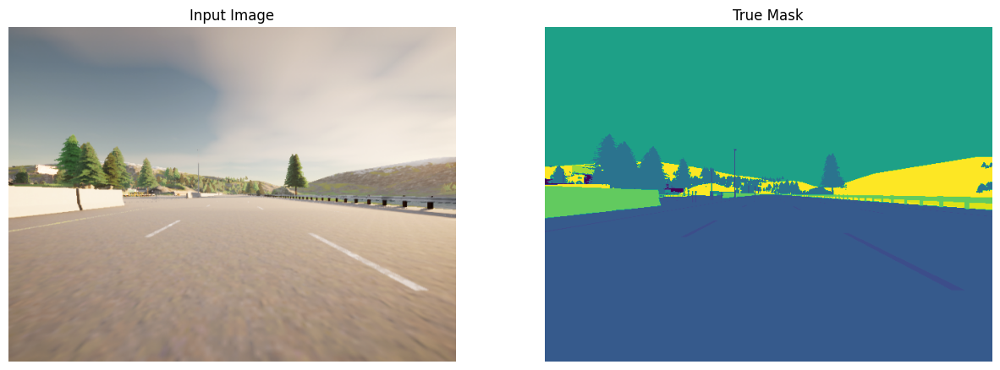
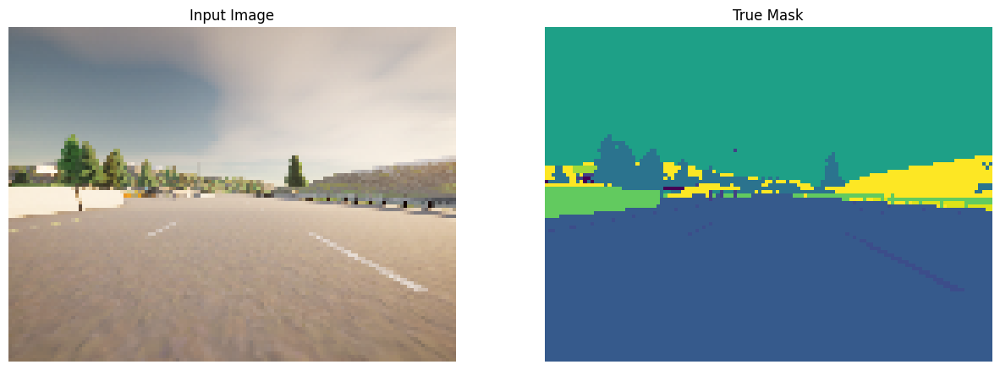
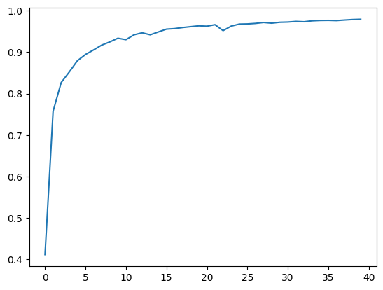
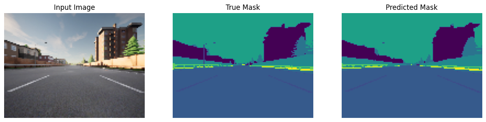
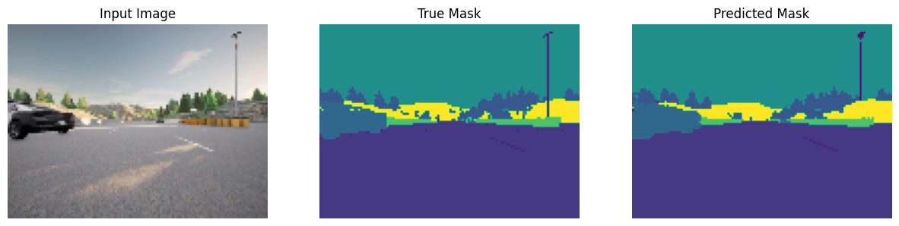
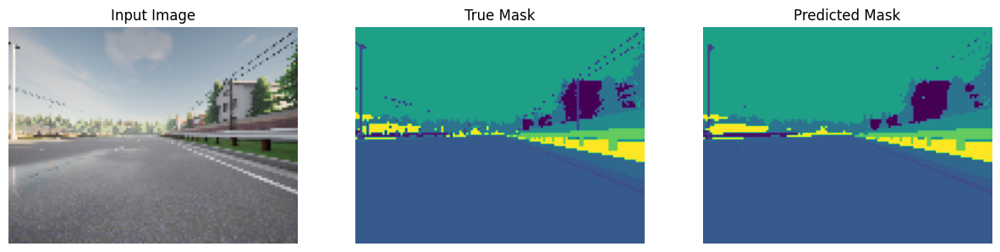
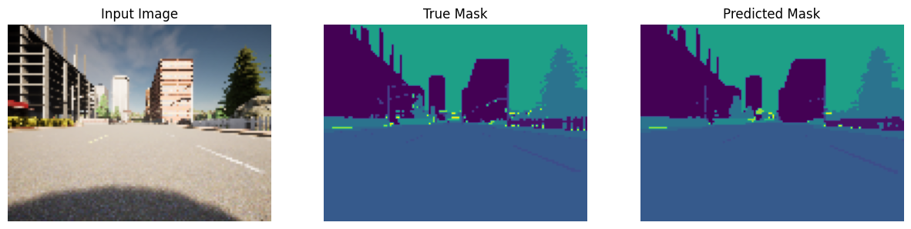
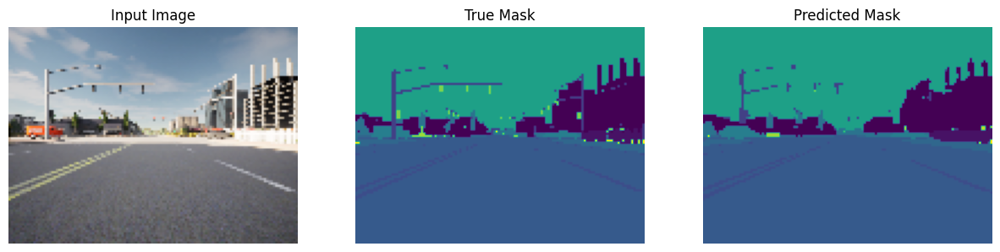
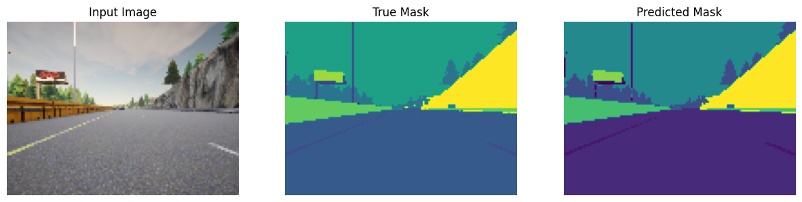

# Image Segmentation with U-Net


<caption><center> <u><b>Figure 1</u></b>: Example of a segmented image <br> </center></caption>

## Table of Content

- [1 - Packages](#1)
- [2 - Load and Split the Data](#2)
    - [2.1 - Split Your Dataset into Unmasked and Masked Images](#2-1)
    - [2.2 - Preprocess Your Data](#2-2)
- [3 - U-Net](#3)
    - [3.1 - Model Details](#3-1)
    - [3.2 - Encoder (Downsampling Block)](#3-2)
        - [Function 1 - conv_block](#ex-1)
    - [3.3 - Decoder (Upsampling Block)](#3-3)
        - [Function 2 - upsampling_block](#ex-2)
    - [3.4 - Build the Model](#3-4)
        - [Function 3 - unet_model](#ex-3)
    - [3.5 - Set Model Dimensions](#3-5)
    - [3.6 - Loss Function](#3-6)
    - [3.7 - Dataset Handling](#3-7)
- [4 - Train the Model](#4)
    - [4.1 - Create Predicted Masks](#4-1)
    - [4.2 - Plot Model Accuracy](#4-2)
    - [4.3 - Show Predictions](#4-3)

<a name='1'></a>
## 1 - Packages


```python
import tensorflow as tf
import numpy as np

from tensorflow.keras.layers import Input
from tensorflow.keras.layers import Conv2D
from tensorflow.keras.layers import MaxPooling2D
from tensorflow.keras.layers import Dropout 
from tensorflow.keras.layers import Conv2DTranspose
from tensorflow.keras.layers import concatenate
```

<a name='2'></a>
## 2 - Load and Split the Data


```python
import os
import numpy as np # linear algebra
import pandas as pd # data processing, CSV file I/O (e.g. pd.read_csv)

import matplotlib.pyplot as plt
%matplotlib inline

path = ''
image_path = os.path.join(path, './data/CameraRGB/')
mask_path = os.path.join(path, './data/CameraMask/')
image_list = os.listdir(image_path)
mask_list = os.listdir(mask_path)
image_list = [image_path+i for i in image_list]
mask_list = [mask_path+i for i in mask_list]
```

### Check out the some of the unmasked and masked images from the dataset:


```python
import imageio
```


```python
N = 1010
img = imageio.imread(image_list[N])
mask = imageio.imread(mask_list[N])
#mask = np.array([max(mask[i, j]) for i in range(mask.shape[0]) for j in range(mask.shape[1])]).reshape(img.shape[0], img.shape[1])

fig, arr = plt.subplots(1, 2, figsize=(14, 10))
arr[0].imshow(img)
arr[0].set_title('Image')
arr[1].imshow(mask[:, :, 0])
arr[1].set_title('Segmentation')
```

    C:\Users\HP\AppData\Local\Temp\ipykernel_13880\2281660190.py:2: DeprecationWarning: Starting with ImageIO v3 the behavior of this function will switch to that of iio.v3.imread. To keep the current behavior (and make this warning disappear) use `import imageio.v2 as imageio` or call `imageio.v2.imread` directly.
      img = imageio.imread(image_list[N])
    C:\Users\HP\AppData\Local\Temp\ipykernel_13880\2281660190.py:3: DeprecationWarning: Starting with ImageIO v3 the behavior of this function will switch to that of iio.v3.imread. To keep the current behavior (and make this warning disappear) use `import imageio.v2 as imageio` or call `imageio.v2.imread` directly.
      mask = imageio.imread(mask_list[N])
    


    Text(0.5, 1.0, 'Segmentation')


    

    


<a name='2-1'></a>
### 2.1 - Split Dataset into Unmasked and Masked Images


```python
image_list_ds = tf.data.Dataset.list_files(image_list, shuffle=False)
mask_list_ds = tf.data.Dataset.list_files(mask_list, shuffle=False)
```


```python
for path in zip(image_list_ds.take(3), mask_list_ds.take(3)):
    print(path)
```

    (<tf.Tensor: shape=(), dtype=string, numpy=b'.\\data\\CameraRGB\\000026.png'>, <tf.Tensor: shape=(), dtype=string, numpy=b'.\\data\\CameraMask\\000026.png'>)
    (<tf.Tensor: shape=(), dtype=string, numpy=b'.\\data\\CameraRGB\\000027.png'>, <tf.Tensor: shape=(), dtype=string, numpy=b'.\\data\\CameraMask\\000027.png'>)
    (<tf.Tensor: shape=(), dtype=string, numpy=b'.\\data\\CameraRGB\\000028.png'>, <tf.Tensor: shape=(), dtype=string, numpy=b'.\\data\\CameraMask\\000028.png'>)
    


```python
image_filenames = tf.constant(image_list)
masks_filenames = tf.constant(mask_list)

dataset = tf.data.Dataset.from_tensor_slices((image_filenames, masks_filenames))

for image, mask in dataset.take(1):
    print(image)
    print(mask)
```

    tf.Tensor(b'./data/CameraRGB/000026.png', shape=(), dtype=string)
    tf.Tensor(b'./data/CameraMask/000026.png', shape=(), dtype=string)
    

<a name='2-2'></a>
### 2.2 - Preprocess Data


```python
def process_path(image_path, mask_path):
    img = tf.io.read_file(image_path)
    img = tf.image.decode_png(img, channels=3)
    img = tf.image.convert_image_dtype(img, tf.float32)

    mask = tf.io.read_file(mask_path)
    mask = tf.image.decode_png(mask, channels=3)
    mask = tf.math.reduce_max(mask, axis=-1, keepdims=True)
    return img, mask

def preprocess(image, mask):
    input_image = tf.image.resize(image, (96, 128), method='nearest')
    input_mask = tf.image.resize(mask, (96, 128), method='nearest')

    return input_image, input_mask

image_ds = dataset.map(process_path)
processed_image_ds = image_ds.map(preprocess)
```

<a name='3'></a>
## 3 - U-Net 

<a name='3-1'></a>
### 3.1 - Model Details


<caption><center> <u><b> Figure 2 </u></b>: U-Net Architecture<br> </center></caption>

**Contracting path** (Encoder containing downsampling steps):

Images are first fed through several convolutional layers which reduce height and width, while growing the number of channels.

The contracting path follows a regular CNN architecture, with convolutional layers, their activations, and pooling layers to downsample the image and extract its features. In detail, it consists of the repeated application of two 3 x 3 unpadded convolutions, each followed by a rectified linear unit (ReLU) and a 2 x 2 max pooling operation with stride 2 for downsampling. At each downsampling step, the number of feature channels is doubled.

**Crop function**: This step crops the image from the contracting path and concatenates it to the current image on the expanding path to create a skip connection. 

**Expanding path** (Decoder containing upsampling steps):

The expanding path performs the opposite operation of the contracting path, growing the image back to its original size, while shrinking the channels gradually.

In detail, each step in the expanding path upsamples the feature map, followed by a 2 x 2 convolution (the transposed convolution). This transposed convolution halves the number of feature channels, while growing the height and width of the image.

Next is a concatenation with the correspondingly cropped feature map from the contracting path, and two 3 x 3 convolutions, each followed by a ReLU. You need to perform cropping to handle the loss of border pixels in every convolution.

**Final Feature Mapping Block**: In the final layer, a 1x1 convolution is used to map each 64-component feature vector to the desired number of classes. The channel dimensions from the previous layer correspond to the number of filters used, so when you use 1x1 convolutions, you can transform that dimension by choosing an appropriate number of 1x1 filters. When this idea is applied to the last layer, you can reduce the channel dimensions to have one layer per class. 

The U-Net network has 23 convolutional layers in total.

<a name='3-2'></a>
### 3.2 - Encoder (Downsampling Block) 


<caption><center> <u><b>Figure 3</u></b>: The U-Net Encoder up close <br> </center></caption>

The encoder is a stack of various conv_blocks:

Each `conv_block()` is composed of 2 **Conv2D** layers  with ReLU activations. We will apply **Dropout**, and **MaxPooling2D** to some conv_blocks, as you will verify in the following sections, specifically to the last two blocks of the downsampling. 

The function will  return two tensors: 
- `next_layer`: That will go into the next block. 
- `skip_connection`: That will go into the corresponding decoding block.

**Note**: If `max_pooling=True`, the `next_layer` will be the output of the MaxPooling2D layer, but the `skip_connection` will be the output of the previously applied layer(Conv2D or Dropout, depending on the case). Else, both results will be identical.  

<a name='ex-1'></a>
### Function 1 - conv_block


```python
def conv_block(inputs=None, n_filters=32, dropout_prob=0, max_pooling=True):
    """
    Convolutional downsampling block
    
    Arguments:
        inputs -- Input tensor
        n_filters -- Number of filters for the convolutional layers
        dropout_prob -- Dropout probability
        max_pooling -- Use MaxPooling2D to reduce the spatial dimensions of the output volume
    Returns: 
        next_layer, skip_connection --  Next layer and skip connection outputs
    """
    
    conv = Conv2D(n_filters, # Number of filters
                  3,   # Kernel size   
                  activation='relu',
                  padding='same',
                  kernel_initializer= 'he_normal')(inputs)
    conv = Conv2D(n_filters, # Number of filters
                  3,# Kernel size   
                  activation='relu',
                  padding='same',
                  kernel_initializer= 'he_normal')(conv)

    
    # if dropout_prob > 0 add a dropout layer, with the variable dropout_prob as parameter
    if dropout_prob > 0:
        conv = Dropout(dropout_prob)(conv)        
    # if max_pooling is True add a MaxPooling2D with 2x2 pool_size
    if max_pooling:
        next_layer = MaxPooling2D(2,strides=2)(conv)
    else:
        next_layer = conv
        
    skip_connection = conv
    
    return next_layer, skip_connection
```

<a name='3-3'></a>
### 3.3 - Decoder (Upsampling Block)

The decoder, or upsampling block, upsamples the features back to the original image size. At each upsampling level, you'll take the output of the corresponding encoder block and concatenate it before feeding to the next decoder block.


<caption><center> <u><b>Figure 4</u></b>: The U-Net Decoder up close <br> </center></caption>

There are two new components in the decoder: `up` and `merge`. These are the transpose convolution and the skip connections. In addition, there are two more convolutional layers set to the same parameters as in the encoder. 

Here you'll encounter the `Conv2DTranspose` layer, which performs the inverse of the `Conv2D` layer. You can read more about it [here.](https://www.tensorflow.org/api_docs/python/tf/keras/layers/Conv2DTranspose)


<a name='ex-2'></a>
### Function 2 - upsampling_block


```python
def upsampling_block(expansive_input, contractive_input, n_filters=32):
    """
    Convolutional upsampling block
    
    Arguments:
        expansive_input -- Input tensor from previous layer
        contractive_input -- Input tensor from previous skip layer
        n_filters -- Number of filters for the convolutional layers
    Returns: 
        conv -- Tensor output
    """
    up = Conv2DTranspose(
                 n_filters,    # number of filters
                 3,# Kernel size
                 strides=2,
                 padding='same')(expansive_input)
    
    # Merge the previous output and the contractive_input
    merge = concatenate([up, contractive_input], axis=3)
    
    conv = Conv2D(n_filters, # Number of filters
                  3,# Kernel size   
                  activation='relu',
                  padding='same',
                  kernel_initializer= 'he_normal')(merge)
    conv = Conv2D(n_filters, # Number of filters
                  3,# Kernel size   
                  activation='relu',
                  padding='same',
                  kernel_initializer= 'he_normal')(conv)
    
    return conv
```

<a name='3-4'></a>
### 3.4 - Build the Model

This is where you'll put it all together, by chaining the encoder, bottleneck, and decoder! You'll need to specify the number of output channels, which for this particular set would be 23. That's because there are 23 possible labels for each pixel in this self-driving car dataset. 


```python
def unet_model(input_size=(96, 128, 3), n_filters=32, n_classes=23):
    """
    Unet model
    
    Arguments:
        input_size -- Input shape 
        n_filters -- Number of filters for the convolutional layers
        n_classes -- Number of output classes
    Returns: 
        model -- tf.keras.Model
    """
    inputs = Input(input_size)
    # Contracting Path (encoding)
    # Add a conv_block with the inputs of the unet_ model and n_filters
    cblock1 = conv_block(inputs=inputs, n_filters=n_filters*1)
    # Chain the first element of the output of each block to be the input of the next conv_block. 
    # Double the number of filters at each new step
    cblock2 = conv_block(inputs=cblock1[0], n_filters=n_filters*2)
    cblock3 = conv_block(inputs=cblock2[0], n_filters=n_filters*4)
    # Include a dropout of 0.3 for this layer
    cblock4 = conv_block(inputs=cblock3[0], n_filters=n_filters*8,dropout_prob=0.3)
    # Include a dropout of 0.3 for this layer, and avoid the max_pooling layer
    cblock5 = conv_block(inputs=cblock4[0], n_filters=n_filters*16,dropout_prob=0.3, max_pooling=False) 

    
    # Expanding Path (decoding)
    # Add the first upsampling_block.
    # From here,at each step, use half the number of filters of the previous block 
    # Use the cblock5[0] as expansive_input and cblock4[1] as contractive_input and n_filters * 8
    ### START CODE HERE
    ublock6 = upsampling_block(cblock5[0], cblock4[1], n_filters*8)
    # Chain the output of the previous block as expansive_input and the corresponding contractive block output.
    # Note that you must use the second element of the contractive block i.e before the maxpooling layer. 
    
    ublock7 = upsampling_block(ublock6, cblock3[1], n_filters*4)
    ublock8 = upsampling_block(ublock7, cblock2[1], n_filters*2)
    ublock9 = upsampling_block(ublock8, cblock1[1], n_filters*1)
  

    conv9 = Conv2D(n_filters,
                 3,
                 activation='relu',
                 padding='same',
                 kernel_initializer='he_normal')(ublock9)

    # Add a Conv2D layer with n_classes filter, kernel size of 1 and a 'same' padding
   
    conv10 = Conv2D(n_classes, 1, padding='same')(conv9)
   
    
    model = tf.keras.Model(inputs=inputs, outputs=conv10)

    return model
```

<a name='3-5'></a>
### 3.5 - Set Model Dimensions


```python
img_height = 96
img_width = 128
num_channels = 3

unet = unet_model((img_height, img_width, num_channels))
```


```python
unet.summary()
```

    Model: "model"
    __________________________________________________________________________________________________
     Layer (type)                   Output Shape         Param #     Connected to                     
    ==================================================================================================
     input_1 (InputLayer)           [(None, 96, 128, 3)  0           []                               
                                    ]                                                                 
                                                                                                      
     conv2d (Conv2D)                (None, 96, 128, 32)  896         ['input_1[0][0]']                
                                                                                                      
     conv2d_1 (Conv2D)              (None, 96, 128, 32)  9248        ['conv2d[0][0]']                 
                                                                                                      
     max_pooling2d (MaxPooling2D)   (None, 48, 64, 32)   0           ['conv2d_1[0][0]']               
                                                                                                      
     conv2d_2 (Conv2D)              (None, 48, 64, 64)   18496       ['max_pooling2d[0][0]']          
                                                                                                      
     conv2d_3 (Conv2D)              (None, 48, 64, 64)   36928       ['conv2d_2[0][0]']               
                                                                                                      
     max_pooling2d_1 (MaxPooling2D)  (None, 24, 32, 64)  0           ['conv2d_3[0][0]']               
                                                                                                      
     conv2d_4 (Conv2D)              (None, 24, 32, 128)  73856       ['max_pooling2d_1[0][0]']        
                                                                                                      
     conv2d_5 (Conv2D)              (None, 24, 32, 128)  147584      ['conv2d_4[0][0]']               
                                                                                                      
     max_pooling2d_2 (MaxPooling2D)  (None, 12, 16, 128)  0          ['conv2d_5[0][0]']               
                                                                                                      
     conv2d_6 (Conv2D)              (None, 12, 16, 256)  295168      ['max_pooling2d_2[0][0]']        
                                                                                                      
     conv2d_7 (Conv2D)              (None, 12, 16, 256)  590080      ['conv2d_6[0][0]']               
                                                                                                      
     dropout (Dropout)              (None, 12, 16, 256)  0           ['conv2d_7[0][0]']               
                                                                                                      
     max_pooling2d_3 (MaxPooling2D)  (None, 6, 8, 256)   0           ['dropout[0][0]']                
                                                                                                      
     conv2d_8 (Conv2D)              (None, 6, 8, 512)    1180160     ['max_pooling2d_3[0][0]']        
                                                                                                      
     conv2d_9 (Conv2D)              (None, 6, 8, 512)    2359808     ['conv2d_8[0][0]']               
                                                                                                      
     dropout_1 (Dropout)            (None, 6, 8, 512)    0           ['conv2d_9[0][0]']               
                                                                                                      
     conv2d_transpose (Conv2DTransp  (None, 12, 16, 256)  1179904    ['dropout_1[0][0]']              
     ose)                                                                                             
                                                                                                      
     concatenate (Concatenate)      (None, 12, 16, 512)  0           ['conv2d_transpose[0][0]',       
                                                                      'dropout[0][0]']                
                                                                                                      
     conv2d_10 (Conv2D)             (None, 12, 16, 256)  1179904     ['concatenate[0][0]']            
                                                                                                      
     conv2d_11 (Conv2D)             (None, 12, 16, 256)  590080      ['conv2d_10[0][0]']              
                                                                                                      
     conv2d_transpose_1 (Conv2DTran  (None, 24, 32, 128)  295040     ['conv2d_11[0][0]']              
     spose)                                                                                           
                                                                                                      
     concatenate_1 (Concatenate)    (None, 24, 32, 256)  0           ['conv2d_transpose_1[0][0]',     
                                                                      'conv2d_5[0][0]']               
                                                                                                      
     conv2d_12 (Conv2D)             (None, 24, 32, 128)  295040      ['concatenate_1[0][0]']          
                                                                                                      
     conv2d_13 (Conv2D)             (None, 24, 32, 128)  147584      ['conv2d_12[0][0]']              
                                                                                                      
     conv2d_transpose_2 (Conv2DTran  (None, 48, 64, 64)  73792       ['conv2d_13[0][0]']              
     spose)                                                                                           
                                                                                                      
     concatenate_2 (Concatenate)    (None, 48, 64, 128)  0           ['conv2d_transpose_2[0][0]',     
                                                                      'conv2d_3[0][0]']               
                                                                                                      
     conv2d_14 (Conv2D)             (None, 48, 64, 64)   73792       ['concatenate_2[0][0]']          
                                                                                                      
     conv2d_15 (Conv2D)             (None, 48, 64, 64)   36928       ['conv2d_14[0][0]']              
                                                                                                      
     conv2d_transpose_3 (Conv2DTran  (None, 96, 128, 32)  18464      ['conv2d_15[0][0]']              
     spose)                                                                                           
                                                                                                      
     concatenate_3 (Concatenate)    (None, 96, 128, 64)  0           ['conv2d_transpose_3[0][0]',     
                                                                      'conv2d_1[0][0]']               
                                                                                                      
     conv2d_16 (Conv2D)             (None, 96, 128, 32)  18464       ['concatenate_3[0][0]']          
                                                                                                      
     conv2d_17 (Conv2D)             (None, 96, 128, 32)  9248        ['conv2d_16[0][0]']              
                                                                                                      
     conv2d_18 (Conv2D)             (None, 96, 128, 32)  9248        ['conv2d_17[0][0]']              
                                                                                                      
     conv2d_19 (Conv2D)             (None, 96, 128, 23)  759         ['conv2d_18[0][0]']              
                                                                                                      
    ==================================================================================================
    Total params: 8,640,471
    Trainable params: 8,640,471
    Non-trainable params: 0
    __________________________________________________________________________________________________
    


```python
unet.compile(optimizer='adam',
              loss=tf.keras.losses.SparseCategoricalCrossentropy(from_logits=True),
              metrics=['accuracy'])
```

<a name='3-7'></a>
### 3.7 - Dataset Handling
Below, define a function that allows you to display both an input image, and its ground truth: the true mask. The true mask is what your trained model output is aiming to get as close to as possible. 


```python
def display(display_list):
    plt.figure(figsize=(15, 15))

    title = ['Input Image', 'True Mask', 'Predicted Mask']

    for i in range(len(display_list)):
        plt.subplot(1, len(display_list), i+1)
        plt.title(title[i])
        plt.imshow(tf.keras.preprocessing.image.array_to_img(display_list[i]))
        plt.axis('off')
    plt.show()
```


```python
for image, mask in image_ds.take(1):
    sample_image, sample_mask = image, mask
    print(mask.shape)
display([sample_image, sample_mask])
```

    (480, 640, 1)
    


    

    


```python
for image, mask in processed_image_ds.take(1):
    sample_image, sample_mask = image, mask
    print(mask.shape)
display([sample_image, sample_mask])
```

    (96, 128, 1)
    


    

    


<a name='4'></a>
## 4 - Train the Model


```python
EPOCHS = 40
VAL_SUBSPLITS = 5
BUFFER_SIZE = 500
BATCH_SIZE = 32
processed_image_ds.batch(BATCH_SIZE)
train_dataset = processed_image_ds.cache().shuffle(BUFFER_SIZE).batch(BATCH_SIZE)
print(processed_image_ds.element_spec)
```

    (TensorSpec(shape=(96, 128, 3), dtype=tf.float32, name=None), TensorSpec(shape=(96, 128, 1), dtype=tf.uint8, name=None))
    


```python
model_history = unet.fit(train_dataset, epochs=EPOCHS)
```

    Epoch 1/40
    34/34 [==============================] - 98s 2s/step - loss: 2.0293 - accuracy: 0.4115
    Epoch 2/40
    34/34 [==============================] - 40s 1s/step - loss: 0.9998 - accuracy: 0.7575
    Epoch 3/40
    34/34 [==============================] - 40s 1s/step - loss: 0.6085 - accuracy: 0.8267
    Epoch 4/40
    34/34 [==============================] - 40s 1s/step - loss: 0.4912 - accuracy: 0.8522
    Epoch 5/40
    34/34 [==============================] - 40s 1s/step - loss: 0.4009 - accuracy: 0.8793
    Epoch 6/40
    34/34 [==============================] - 41s 1s/step - loss: 0.3489 - accuracy: 0.8944
    Epoch 7/40
    34/34 [==============================] - 41s 1s/step - loss: 0.3147 - accuracy: 0.9053
    Epoch 8/40
    34/34 [==============================] - 41s 1s/step - loss: 0.2771 - accuracy: 0.9169
    Epoch 9/40
    34/34 [==============================] - 41s 1s/step - loss: 0.2512 - accuracy: 0.9247
    Epoch 10/40
    34/34 [==============================] - 40s 1s/step - loss: 0.2241 - accuracy: 0.9336
    Epoch 11/40
    34/34 [==============================] - 40s 1s/step - loss: 0.2356 - accuracy: 0.9301
    Epoch 12/40
    34/34 [==============================] - 41s 1s/step - loss: 0.1950 - accuracy: 0.9419
    Epoch 13/40
    34/34 [==============================] - 40s 1s/step - loss: 0.1791 - accuracy: 0.9467
    Epoch 14/40
    34/34 [==============================] - 40s 1s/step - loss: 0.1957 - accuracy: 0.9419
    Epoch 15/40
    34/34 [==============================] - 40s 1s/step - loss: 0.1712 - accuracy: 0.9488
    Epoch 16/40
    34/34 [==============================] - 40s 1s/step - loss: 0.1483 - accuracy: 0.9555
    Epoch 17/40
    34/34 [==============================] - 40s 1s/step - loss: 0.1433 - accuracy: 0.9568
    Epoch 18/40
    34/34 [==============================] - 40s 1s/step - loss: 0.1349 - accuracy: 0.9594
    Epoch 19/40
    34/34 [==============================] - 40s 1s/step - loss: 0.1274 - accuracy: 0.9615
    Epoch 20/40
    34/34 [==============================] - 40s 1s/step - loss: 0.1208 - accuracy: 0.9636
    Epoch 21/40
    34/34 [==============================] - 41s 1s/step - loss: 0.1235 - accuracy: 0.9626
    Epoch 22/40
    34/34 [==============================] - 40s 1s/step - loss: 0.1112 - accuracy: 0.9663
    Epoch 23/40
    34/34 [==============================] - 41s 1s/step - loss: 0.1617 - accuracy: 0.9519
    Epoch 24/40
    34/34 [==============================] - 41s 1s/step - loss: 0.1227 - accuracy: 0.9628
    Epoch 25/40
    34/34 [==============================] - 41s 1s/step - loss: 0.1059 - accuracy: 0.9677
    Epoch 26/40
    34/34 [==============================] - 41s 1s/step - loss: 0.1040 - accuracy: 0.9681
    Epoch 27/40
    34/34 [==============================] - 41s 1s/step - loss: 0.0999 - accuracy: 0.9694
    Epoch 28/40
    34/34 [==============================] - 41s 1s/step - loss: 0.0926 - accuracy: 0.9716
    Epoch 29/40
    34/34 [==============================] - 40s 1s/step - loss: 0.0971 - accuracy: 0.9699
    Epoch 30/40
    34/34 [==============================] - 40s 1s/step - loss: 0.0895 - accuracy: 0.9721
    Epoch 31/40
    34/34 [==============================] - 40s 1s/step - loss: 0.0881 - accuracy: 0.9727
    Epoch 32/40
    34/34 [==============================] - 40s 1s/step - loss: 0.0832 - accuracy: 0.9741
    Epoch 33/40
    34/34 [==============================] - 41s 1s/step - loss: 0.0856 - accuracy: 0.9733
    Epoch 34/40
    34/34 [==============================] - 41s 1s/step - loss: 0.0780 - accuracy: 0.9756
    Epoch 35/40
    34/34 [==============================] - 40s 1s/step - loss: 0.0752 - accuracy: 0.9765
    Epoch 36/40
    34/34 [==============================] - 40s 1s/step - loss: 0.0739 - accuracy: 0.9767
    Epoch 37/40
    34/34 [==============================] - 40s 1s/step - loss: 0.0757 - accuracy: 0.9761
    Epoch 38/40
    34/34 [==============================] - 40s 1s/step - loss: 0.0711 - accuracy: 0.9775
    Epoch 39/40
    34/34 [==============================] - 40s 1s/step - loss: 0.0669 - accuracy: 0.9787
    Epoch 40/40
    34/34 [==============================] - 40s 1s/step - loss: 0.0650 - accuracy: 0.9793
    

<a name='4-1'></a>
### 4.1 - Create Predicted Masks 


```python
def create_mask(pred_mask):
    pred_mask = tf.argmax(pred_mask, axis=-1)
    pred_mask = pred_mask[..., tf.newaxis]
    return pred_mask[0]
```

<a name='4-2'></a>
### 4.2 - Plot Model Accuracy


```python
plt.plot(model_history.history["accuracy"])
```


    [<matplotlib.lines.Line2D at 0x28197777580>]


    

    


<a name='4-3'></a>
### 4.3 - Show Predictions 


```python
def show_predictions(dataset=None, num=1):
    """
    Displays the first image of each of the num batches
    """
    if dataset:
        for image, mask in dataset.take(num):
            pred_mask = unet.predict(image)
            display([image[0], mask[0], create_mask(pred_mask)])
    else:
        display([sample_image, sample_mask,
             create_mask(unet.predict(sample_image[tf.newaxis, ...]))])
```


```python
show_predictions(train_dataset, 6)
```

    1/1 [==============================] - 0s 292ms/step
    


    

    


    1/1 [==============================] - 0s 29ms/step
    


    

    


    1/1 [==============================] - 0s 33ms/step
    


    

    


    1/1 [==============================] - 0s 35ms/step
    


    

    


    1/1 [==============================] - 0s 36ms/step
    


    

    


    1/1 [==============================] - 0s 32ms/step
    


    

    


### Conclusion 

<font color='blue'>
    
**RECAP**: 

* Semantic image segmentation predicts a label for every single pixel in an image
* U-Net uses an equal number of convolutional blocks and transposed convolutions for downsampling and upsampling
* Skip connections are used to prevent border pixel information loss and overfitting in U-Net
